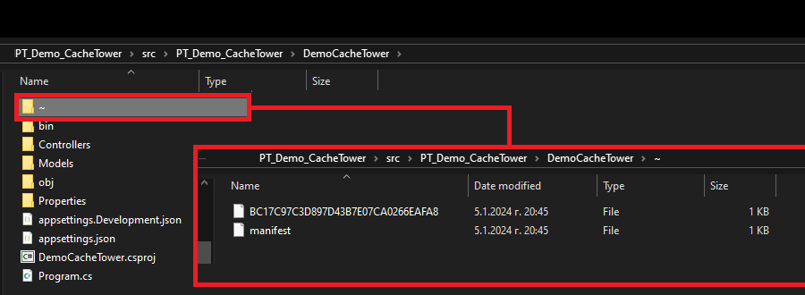

# PT_Demo_CacheTower

[Cache Tower](https://github.com/TurnerSoftware/CacheTower) isn't a single type of cache, its a multi-layer solution to caching with each layer on top of another.<br>A multi-layer cache provides the performance benefits of a fast cache like in-memory with the resilience of a file, database or Redis-backed cache.

## Contents
- [Prerequisites](#prerequisites)
- [CacheTower](#cachetower)
    - [In-memory Caching](#in-memory-caching)
    - [File-based Caching](#file-based-caching)
    - [Redis Caching](#redis-caching)
- [Links](#links)

## Prerequisites

1. Create new blank .NET Solution `PT_Demo_CacheTower` and add new .NET 6 Web API project `DemoCacheTower`.

2. Introduce new classes `UserProfile.cs` and `UserContext.cs`:

```
using ProtoBuf;

namespace DemoCacheTower.Models;

[ProtoContract]
public class UserProfile
{
    [ProtoMember(1)]
    public int UserId { get; set; }
    [ProtoMember(2)]
    public string UserName { get; set; }
    [ProtoMember(3)]
    public DateTime DateCreatedOrUpdated { get; set; }
}
```

```
public class UserContext
{
    public async Task<UserProfile> GetUserForIdAsync(int id)
    {
        return new UserProfile
        {
            UserId = id,
            UserName = $"username-{id}",
            DateCreatedOrUpdated = DateTime.Now
        };
    }
}
```

3. Add `UserContext` to container in `Program.cs`:

```
            builder.Services.AddSingleton<UserContext>();
```

4. Install the following NuGet packages:

```
Install-Package CacheTower
Install-Package CacheTower.Providers.Redis
```

## CacheTower

### In-memory Caching

0. Do steps from [Prerequisites](#prerequisites) section.

1. AddCacheStack in `Program.cs`:

```
            builder.Services.AddCacheStack<UserContext>((provider, builder) => builder
                .AddMemoryCacheLayer()
                //.AddRedisCacheLayer(/* Your Redis Connection */, new RedisCacheLayerOptions(ProtobufCacheSerializer.Instance))
                .WithCleanupFrequency(TimeSpan.FromMinutes(5)));
```

2. Create new CacheTowerController.cs:

```
using DemoCacheTower.Models;

namespace DemoCacheTower;

public class Program
{
    public static void Main(string[] args)
    {
        var builder = WebApplication.CreateBuilder(args);

        builder.Services.AddSingleton<UserContext>();

        builder.Services.AddControllers();
        builder.Services.AddEndpointsApiExplorer();
        builder.Services.AddSwaggerGen();

        // =============== 1) MemoryCache ===============
        builder.Services.AddCacheStack<UserContext>((provider, builder) => builder
            .AddMemoryCacheLayer()
            .WithCleanupFrequency(TimeSpan.FromMinutes(5)));

        var app = builder.Build();

        if (app.Environment.IsDevelopment())
        {
            app.UseSwagger();
            app.UseSwaggerUI();
        }

        app.UseHttpsRedirection();
        app.UseAuthorization();
        app.MapControllers();
        app.Run();
    }
}
```

3. Test

### File-based Caching

*Provides a basic file-based caching solution using your choice of serializer.<br>
It stores each serialized cache item into its own file and uses a singular manifest file to track the status of the cache.*



0. Do steps from [MemoryCache](#memorycache) section.

1. Install NuGet package `NewtonsoftJsonCacheSerializer`:

```
Install-Package CacheTower.Serializers.NewtonsoftJson
```

*The FileCacheLayer and RedisCacheLayer support custom serializers for caching data. Different serializers have different performance profiles as well as different tradeoffs for configuration.*

2. Update `CacheTowerController.cs` as follows:

```
using CacheTower.Providers.FileSystem;
using CacheTower.Serializers.NewtonsoftJson;
using DemoCacheTower.Models;

namespace DemoCacheTower;

public class Program
{
    public static void Main(string[] args)
    {
        var builder = WebApplication.CreateBuilder(args);

        builder.Services.AddSingleton<UserContext>();

        builder.Services.AddControllers();
        builder.Services.AddEndpointsApiExplorer();
        builder.Services.AddSwaggerGen();

        // =============== 2) FileCache ===============
        builder.Services.AddCacheStack<UserContext>((provider, builder) => builder
            .AddFileCacheLayer(new FileCacheLayerOptions("~/", NewtonsoftJsonCacheSerializer.Instance))
            .WithCleanupFrequency(TimeSpan.FromMinutes(5)));

        var app = builder.Build();

        if (app.Environment.IsDevelopment())
        {
            app.UseSwagger();
            app.UseSwaggerUI();
        }

        app.UseHttpsRedirection();
        app.UseAuthorization();
        app.MapControllers();
        app.Run();
    }
}
```

3. Test

### Redis Caching

0. Do steps from [MemoryCache](#memorycache) section.

1. Pull the Redis image and run Redis in a Docker container:

```
docker pull redis
docker run -p 6379:6379 --name myrediscontainer redis
```

You can try if Redis works properly:

```
docker ps // get container ID
docker exec -it 417674d114ae /bin/bash

redis cli
set mypetar mytotev
get mypetar
```

2. Install NuGet package `CacheTower.Providers.Redis`:

```
Install-Package CacheTower.Providers.Redis
```

3. Update `CacheTowerController.cs` as follows:

```
using CacheTower.Providers.Redis;
using CacheTower.Serializers.Protobuf;
using DemoCacheTower.Models;
using StackExchange.Redis;

namespace DemoCacheTower;

public class Program
{
    public static void Main(string[] args)
    {
        var builder = WebApplication.CreateBuilder(args);

        builder.Services.AddSingleton<UserContext>();

        builder.Services.AddControllers();
        builder.Services.AddEndpointsApiExplorer();
        builder.Services.AddSwaggerGen();

        // =============== 3) RedisCache ===============
        builder.Services.AddCacheStack<UserContext>((provider, builder) => builder
            .AddRedisCacheLayer(
                ConnectionMultiplexer.Connect("127.0.0.1:6379"),
                new RedisCacheLayerOptions(ProtobufCacheSerializer.Instance))
            .WithCleanupFrequency(TimeSpan.FromMinutes(5)));

        var app = builder.Build();

        if (app.Environment.IsDevelopment())
        {
            app.UseSwagger();
            app.UseSwaggerUI();
        }

        app.UseHttpsRedirection();
        app.UseAuthorization();
        app.MapControllers();
        app.Run();
    }
}
```

4. Test by calling this endpoint:

```
[GET] http://localhost:5001/CacheTower/MemoryCache/333
```

Output:
```
{"userId":333,"userName":"username-333","dateCreatedOrUpdated":"2024-01-06T14:17:27.7376917+02:00"}
```

Next, you can try to get the value using the `redis-cli` command prompt ((see step 1)):

```
127.0.0.1:6379> get user-333
```

Output:
```
"\n\b\b\xb8\xd4\xd4\xd9\x0c\x10\x03\x12\x1e\b\xde\x01\x12\x0cusername-222\x1a\x0b\b\x80\xb1\x8a\xa9\xf0\xb2\xc7<\x10\x05"
```

## Links
- https://github.com/TurnerSoftware/CacheTower
- https://www.nuget.org/packages/CacheTower